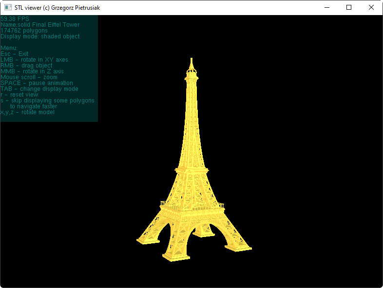

# STL File Viewer for Windows

This is a simple **STL file viewer** 32-bit application built for **Windows** using the **Win32 API** and the **FreeGLUT library**. The application allows you to load and view STL files (commonly used in 3D printing) interactively. It provides basic visualization of 3D models, allowing users to rotate and inspect STL files.

## Screenshot

Here is a screenshot of the STL file viewer application in action:



## Features
- Load STL files and view them in 3D.
- Rotate and zoom the model for better inspection.
- Uses FreeGLUT library for OpenGL rendering.
- View 3D model in various modes (wireframe, outlined triangles)

## Prerequisites
Before running the application, make sure that the following libraries are installed:

- freeglut.dll

## Installation

1. **Clone the repository:**

    ```bash
    git clone https://github.com/gps79/STL_viewer.git
    ```

2. **Get the build environment:**

    Download and install MinGW with GCC-6.3.0-1
   
    Download [freeGlut-MinGW-3.0.0-1](https://www.transmissionzero.co.uk/files/software/development/GLUT/) library

   Extract **FreeGLUT** include, lib and bin directories content in appropriate directories of your GCC compiler

4. **Build the application:**

    Open the project in **Code::Blocks** IDE and build the application,
   
   or in the MinGW console type:
   ```bash
   make all
   ```

5. **Run the application:**

    Once the project is built, you can run the executable `stl_viewer.exe <file>.stl` to view the STL file.

## Documentation

  Developer's documentation can be found [here](https://gps79.github.io/STL_viewer/doc/html/index.html).

## License

This project is licensed under the MIT License - see the [LICENSE](LICENSE) file for details.

